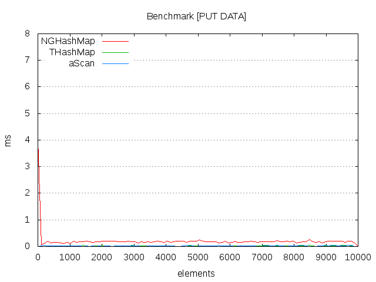
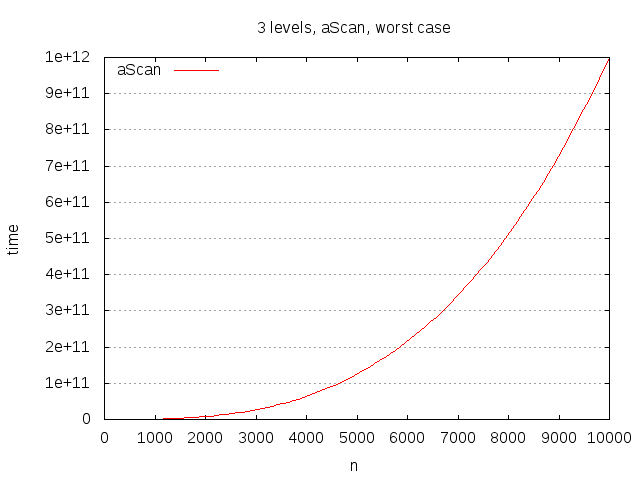

# NGHashMap

> Implementação de hashmaps nativos auto-expansíveis para AdvPL e Harbour

## Objetivo

Prover uma implementação eficiente e configurável de dicionários com complexidade de acesso O(1) de maneira independente e auto-escalável com uma API de acesso **humanizada**, testada e documentada.
Apesar da existência da classe `tHashMap` no AdvPL, sua interface não é suficientemente amigável para utilização pelos programadores como em linguagens como Python, OCaml e até mesmo Java.

## Instalando

A única dependência é o fonte [src/nghashmap.prw](./src/nghashmap.prw). Compile-o em seu repositório.

## Contribuindo

Contribuições são bem-vindas, tanto em melhoras no algoritmo de hash para redução de colisões (DJB atualmente), quanto em otimizações de performance, documentação ou coding-style. Os testes estão escritos utilizando a [advpl-testsuite](https://github.com/nginformatica/advpl-testsuite), esperando 100% de cobertura e isolados por features. Eles estão em [test/nghashmap.test.prw](./src/nghashmap.test.prw).

## Documentação

### Índice

- [New( nSize, cMode )](#new-nsize-cmode)
- [Free()](#free)
- [Get( cKey )](#get-ckey)
- [GetOptional( cKey, xDefault )](#getoptional-ckey-xdefault)
- [Hash( cKey )](#hash)
- [Has( cKey )](#has)
- [Keys()](#keys)
- [Length()](#length)
- [Put( cKey, xValue )](#put-ckey-xvalue)
- [Remove( cKey )](#remove-ckey)

### Métodos Públicos

#### `New( nSize, cMode )`

- `nSize`, numérico, opcional, número de elementos pré-alocados
- `cMode`, caractere, configuração de hashing

> Cria uma instância de um hashmap. Se `nSize` não for provido, usa-se o padrão `256`. Use-o para pré-alocar o espaço para os elementos quando a quantidade aproximada de elementos for conhecida. Alocar um número pequeno para uma grande quantidade irá ativar o redimensionamento automático interno do hashmap.
`cMode` pode ser `I`, `T` ou `I` + `T`.

Aconselha-se o uso do header:

```c
#define HASHMAP_CMP_IGNORE_CASE 'I'
#define HASHMAP_CMP_TRIM        'T'
```

Se `HASHMAP_CMP_IGNORE_CASE`, o acesso e a inserção no hashmap não irão considerar a sensibilidade à caixa, permitindo alternar entre maiúsculas e minúsculas.
Se `HASHMAP_CMP_TRIM`, o acesso e a inserção no hashmap não irão considerar a sensibilidade aos espaços extras. Você pode combiná-los com `HASHMAP_CMP_IGNORE_CASE + HASHMAP_CMP_TRIM`

```xbase
Local oMap := NGHashMap():New()
oMap:Put( 'hello', 'world' )
```

### `Free()`

> Libera os slots internos da memória e invalida o objeto. Use quando for descartar o hashmap. Lembre-se também de chamar `FreeObj` no hashmap.

```xbase
oMap:Free()
```

### `Get( cKey )`

- `cKey`, caractere, obrigatório, chave de busca

> Obtém um valor do hashmap baseado em uma chave. Se estiver configurado para insensibilidade à caixa ou espaços, a configuração será considerada. Retorna `NIL` caso um elemento não exista. Tem complexidade O(1) amortizada.

```xbase
Local oMap := NGHashMap():New( 10 )
oMap:Put( 'potato', 'batata' )
oMap:Put( 'tomato', 'tomate' )

ConOut( oMap:Get( 'potato' ) ) // 'batata'
ConOut( oMap:Get( 'banana' ) ) // NIL
```

### `GetOptional( cKey, xDefault )`

- `cKey`, caractere, obrigatório, chave de busca
- `xDefault`, qualquer, opcional, valor a retornar

> Similar a [Get](#get-ckey), mas recebe um segundo parâmetro `xDefault` que é retornado caso a chave não exista no hashmap. Se o valor localizado na chave for `NIL`, no entanto, retorna-se ele mesmo (`NIL`).

```xbase
Local oMap := NGHashMap():New( 10 )
oMap:Put( 'potato', 'batata' )
oMap:Put( 'tomato', 'tomate' )
oMap:Put( 'pineapple', Nil )

ConOut( oMap:GetOptional( 'potato', 'socorro' ) ) // 'batata'
ConOut( oMap:GetOptional( 'banana', 'tudo é terrível' ) ) // 'tudo é terrível'
ConOut( oMap:GetOptional( 'pineapple', 'abacaxi' ) ) // NIL
```

### `Hash( cKey )`

- `cKey`, caractere, chave a manipular

> Retorna o valor em hash da chave. O valor hash vai variar, existindo, entre `1` e `n` onde `n` é o número de _buckets_ pré-alocados. Quando repete-se a chaves diferentes, significa que o _bucket_ para as chaves que incidem no mesmo hash é compartilhado (_encadeado_). Este valor é
determinístico com base nos _buckets_ alocados. Quando o hashmap expande-se automaticamente, os valores de hash de cada chave são recomputados e realocados.

### `Has( cKey )`

- `cKey`, caractere, obrigatório, chave de busca

> Similar a [Get](#get-ckey), é uma função de baixo custo e complexidade constante que informa se uma chave existe em um hashmap.

```xbase
Local oMap := NGHashMap():New( Nil, HASHMAP_CMP_IGNORE_CASE )
oMap:Put( 'potato', 'batata' )
oMap:Put( 'tomato', 'tomate' )

ConOut( oMap:Has( 'POTATO' ) ) // .T.
ConOut( oMap:Has( 'HOPE' ) ) // .F.
```

### `Keys()`

> Lista todas as chaves do hashmap. Utilize-a para iterar os elementos. A ordem de inserção não é preservada (pois é irrelevante em um hashmap, já que os valores são alocados em slots distintos).

```xbase
Local oMap := NGHashMap():New()
oMap:Put( 'potato', 'batata' )
oMap:Put( 'tomato', 'tomate' )

oMap:Keys() // { 'potato', 'tomato' }
```

### `Length()`

> Retorna o tamanho do hashmap de maneira constante, isto é, a quantidade de elementos que ele contém de maneira pré-computada.

```xbase
Local oMap := NGHashMap():New()

ConOut( oMap:Length() ) // 0

oMap:Put( 'potato', 'batata' )
oMap:Put( 'tomato', 'tomate' )

ConOut( oMap:Length() ) // 2
```

### `Put( cKey, xValue )`

- `cKey`, caractere, obrigatório, chave de busca/inserção
- `xValue`, qualquer, opcional, valor a inserir (`NIL` padrão)

> Insere ou substitui um elemento no hashmap com base em uma chave. Se o elemento não existe, é inserido, senão, o valor em seu slot é substituído e não modifica-se o tamanho do hashmap. As flags `HASHMAP_CMP_TRIM` e `HASHMAP_CMP_IGNORE_CASE` são consideradas.

```xbase
Local oMap := NGHashMap():New()
oMap:Put( 'tudo', 'everything' )
oMap:Put( 'é', 'is' )
oMap:Put( 'terrível', 'terrible' )
```

### `Remove( cKey )`

- `cKey`, caractere, obrigatório, chave de busca

> Remove um elemento do hashmap e retorna se ele foi de fato encontrado/removido e adapta o layout de memória do hashmap para desconsiderá-lo. Retorna `.T.` caso o elemento tenha sido encontrado e removido ou `.F.` caso contrário.


```xbase
Local oMap := NGHashMap():New()
oMap:Put( 'tudo', 'everything' )
oMap:Put( 'é', 'is' )
oMap:Put( 'bom', 'bom' )

oMap:Remove( 'tudo' ) // .T.
oMap:Remove( 'eita' ) // .F.
```

## Benchmarks

Os benchmarks foram realizados considerando operações de `GET` e `PUT` com 10000 elementos considerando as implementações de `NGHashMap`, `tHashMap` e busca em array via `aScan`, como costuma ser prática comum (negativa, no entanto) para se trabalhar com dados associativos na linguagem. O source encontra-se em [benchmarks/nghashmap.bench.prw](./benchmarks/nghashmap.bench.prw) e há os arquivos `get.gnu` e `put.gnu` em _GNUPlot_ para gerar os gráficos com a curva de crescimento.

Tanto a `NGHashMap` quanto a `tHashMap` apresentaram mesma complexidade assintótica (constante, `O(1)` amortizado) para encontrar por chave. Busca em array, no entanto, como esperado, apresentou-se linear, `O(n)`. O custo de inserção é maior na `NGHashMap`, mas não cresce de acordo com a tamanho da entrada. Note que os gráficos consideram tempo de execução em segundos no eixo `y`.

- Inserção de dados com chaves



- Busca por chave


Se formos considerar, então, a situação hipotética de buscas dentro de maps com sub-maps, em 3 níveis, a curva de crescimento e custo de busca em hashmaps continuará constante, enquanto que buscas lineares serão exponenciais:



## Licença

Licenciado sob MIT.
